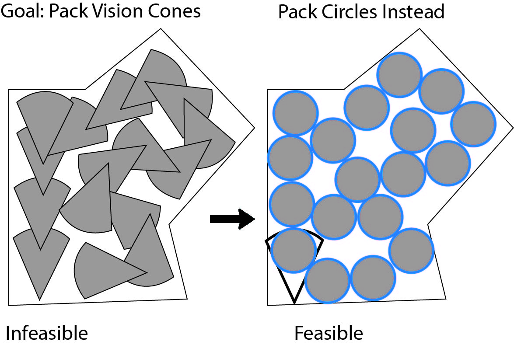
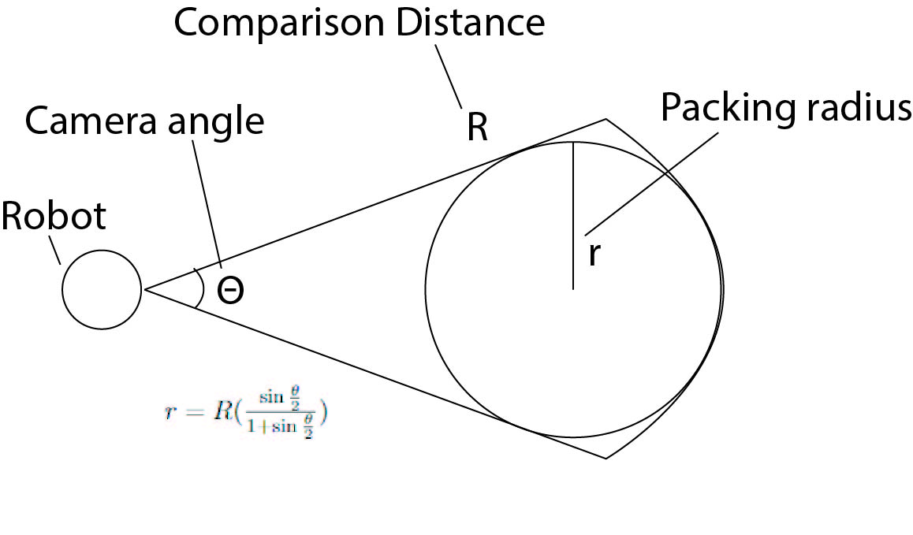
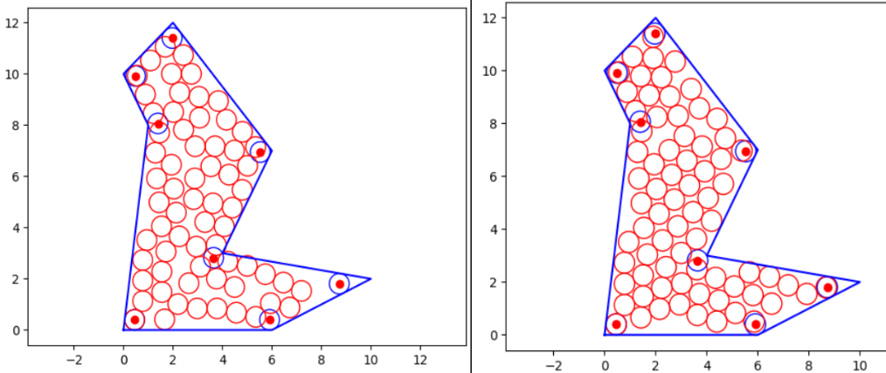
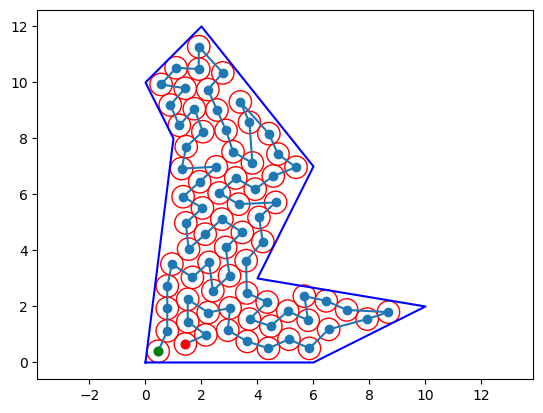

# Path Planning and Automatic Exploration

## Navigation

- [Home](index.md): Overview
- [Path Planning](path-planning.md): Novel Exploration Heuristic
- [Computer Vision](computer-vision.md): NeRF implementation and image
  comparison details
- [Milestones and Ethics Statement](milestones.md):

## Goal

### Create a heuristic algorithm which enables a robot to autonomously explore a known, bounded space more efficiently than conventional methods.

There is a large body of work exploring how to get a robot to autonomously
pathplan to drive over an entire space, this problem is known as coverage.
Because we do not need our robot to stand in every location, as is the case with
lawnmower approaches, but instead to just look at every location, we can be less
meticulous in our movement. Because our Neural Network approach is relatively
costly to produce images, a secondary goal is to create an algorithm which can
view an entire space in a relatively small number of image captures.

## Theory of Efficacy

The initial assumption of this heuristic is that the robot in use is
nonholonomic and utilizes a camera which is effictively one directional with
some viewing angle. There is therefore some penalty in time in completing some
full rotation to look at an entire scene. Note, this approach would still work
with a 360 degree camera though traditional coverage methods may be more
effective in that scenario. One can imagine starting at a point and packing
cones of vision, defined by the angle of the camera and whatever effective
distance your algorithm can make meaningful comparisons at. If one tries to
literally pack consecutive cones then a couple issues arise, namely there are no
algorithms for packing cones in arbitrary shapes and even if there were it would
be incredibly time consuming to move to a certain pose and rotate to an
orientation orientation if two packed cones are not easily reachable from each
other. Circle packing is able to encode the process of packing cones in a
solvable manner while allowing more flexibility for optimal pathing since a
single circle can represent any orientation of a cone.

The circles used are inscribed circles in the vision cones. It is possible to
exactly find the radius of the inscribed circle using the angle of the vision
cone and the radius using geometry.

Packing circles within a space and then iterating through, viewing each circle
in order ensures that the majority of a space is viewed by the robot.
Additionally, because the robot must turn and move to get to the proper viewing
distance and orientation to view a circle, more of the space than prescribed can
be viewed and analyzed.

## Implementation

The steps to implement this algorithm include describing the space to explore
geometrically using a series of vertices as well as inputting the necessary size
circle to pack (based on the viewing angle and distance). The algorithm will
them pack circles within the closed polygon and output a list of circle centers.
The traveling salesman problem is then solved on these points to find a shortest
path route between the waypoints starting at the robot start location. The
final, ordered list of points is then iterated through with the robot PID
navigating to an orientation and distance which view the circle center. When the
robot is sufficiently close and oriented towards a waypoint, the next waypoint
is chosen and navigated towards. The robot may either perform its computer
vision tasks continuously while navigating or only while directly facing a
waypoint.

The circle packer works by a smaller area within the larger polygon where
placing a circle will always be allowable. Once this area is found, the
algorithm will start in a corner and place a circle. The algorithm will then use
depth first search to place circles 2 radii away from the base circle and will
continue until no more valid circles may be placed within a space. This approach
works on both convex and concave polygons. The paper on this circle packing
technique uses depth first search but we found that using breadth first search
resulted in better circle packings. DFS is on the left while BFS is on the
right.

A path created by our pathplanning algorithm.

